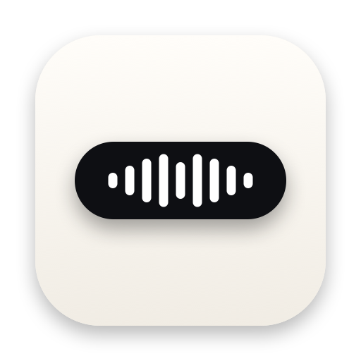
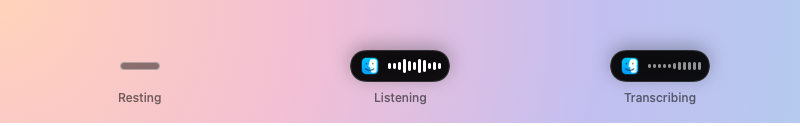
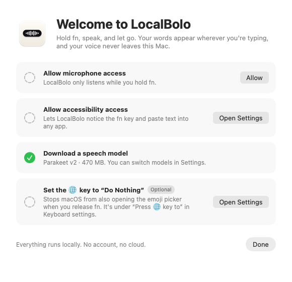
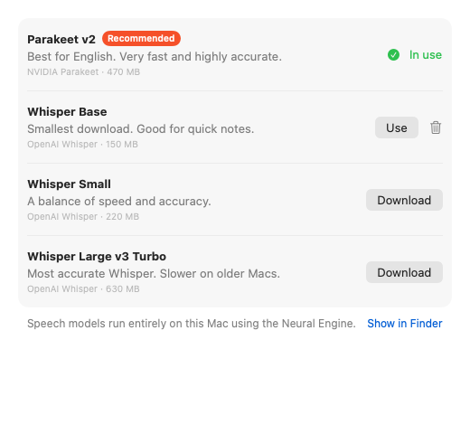
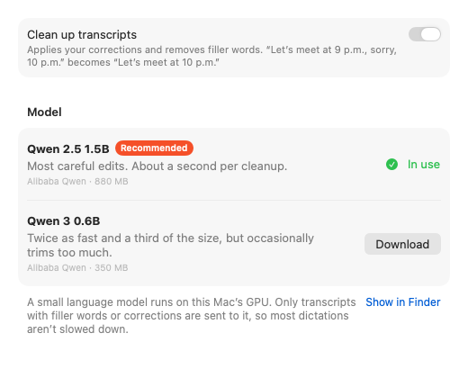
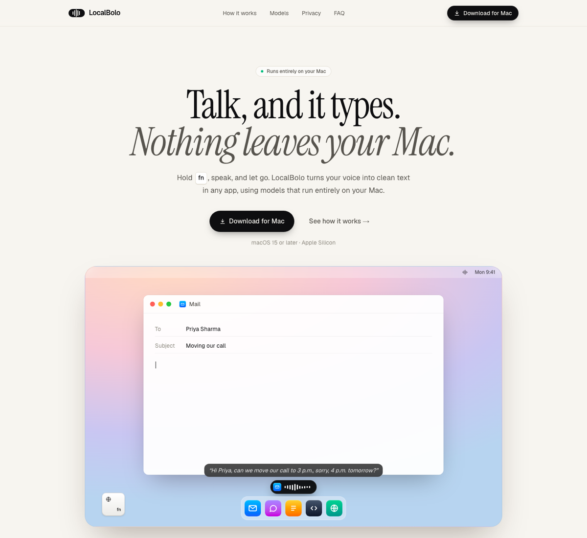

<p align="center">
  
</p>

<h1 align="center">LocalBolo</h1>

<p align="center">
  Private, on-device voice dictation for macOS.<br>
  Hold <kbd>fn</kbd>, speak, and let go. Your words appear wherever you're typing.
</p>

<p align="center">
  
  
  
  
</p>

<p align="center">
  
</p>

LocalBolo is a menu bar app that turns speech into text in any app: Mail, Slack, your code
editor, a browser tab. Speech recognition runs on your Mac's Neural Engine and optional cleanup
runs on its GPU, so **your voice never leaves your Mac**. There's no account, no server, and no
internet connection needed after the models are downloaded.

## Features

- **Hold fn to dictate, anywhere.** Release the key and the transcript is pasted at your cursor.
  fn keeps working as a normal modifier: a quick tap, or fn plus another key, doesn't dictate.
- **Shows where your words will land.** A small pill at the bottom of the screen grows into a
  live waveform next to the icon of the app that will receive the text.
- **On-device and fast.** NVIDIA's Parakeet transcribes 38 seconds of speech in about 0.3 s on an M1.
- **Cleans up as you talk (optional).** A small language model applies your self-corrections and
  removes filler words: *"let's meet at 9 p.m., sorry, 10 p.m."* becomes *"Let's meet at 10 p.m."*
- **Clipboard-safe.** Text is pasted through the clipboard, which is then restored.
- **Choose your models.** Parakeet by default, or OpenAI Whisper in three sizes.

## Screenshots

| First-run setup | Speech models | Transcript cleanup |
| :---: | :---: | :---: |
|  |  |  |

<p align="center">
  
</p>

## System requirements

| | |
| --- | --- |
| **Chip** | Apple Silicon (M1 or newer). Intel Macs aren't supported: Parakeet and MLX only run on Apple Silicon, and the app is built for `arm64` only. |
| **macOS** | 15 Sequoia or later |
| **Memory** | 8 GB or more. The app uses about 1.1 GB with transcript cleanup on. |
| **Disk** | About 60 MB for the app, plus models: Parakeet ~450 MB, and optionally the cleanup model ~840 MB |
| **Keyboard** | One whose fn / 🌐 key macOS can see, such as a MacBook keyboard or an Apple Magic Keyboard. Many third-party keyboards handle Fn internally and never report it. |
| **Permissions** | Microphone (to record while fn is held) and Accessibility (to see fn from any app and paste with ⌘V) |
| **Network** | Only to download models from Hugging Face the first time |
| **Language** | English |

## Getting started

Signed releases will be published on the [Releases](https://github.com/Thinking-Sound-Lab/localbolo/releases)
page. Until then, build the app from source.

### Build from source

You need Xcode 26 or later with the Metal Toolchain, which MLX uses to compile its GPU kernels:

```sh
xcodebuild -downloadComponent MetalToolchain
git clone https://github.com/Thinking-Sound-Lab/localbolo.git
open localbolo/apps/mac/LocalBolo.xcodeproj
```

Choose the **LocalBolo Dev** scheme and run. On the first build Xcode resolves the Swift packages
and asks you to **Trust & Enable** the `CudaBuild` plugin from mlx-swift. It does nothing on a
Mac, but Xcode asks about every package plugin.

### First launch

LocalBolo lives in the menu bar and has no Dock icon. A setup window walks you through:

1. **Microphone** access.
2. **Accessibility** access.
3. Downloading the **Parakeet** speech model (about 470 MB).
4. Optionally setting System Settings › Keyboard › "Press 🌐 key to" to **Do Nothing**, so macOS
   doesn't also open the emoji picker when you release fn.

The first launch after installing or updating takes about 45 seconds while the speech model is
optimized for your Mac's Neural Engine. After that the app is ready in about 2 seconds.

### Transcript cleanup

Turn it on in **Settings › Cleanup** or from the menu bar. It downloads Qwen 2.5 1.5B (about
840 MB) and runs it on the GPU with MLX:

- **Only when needed.** Transcripts without filler words, repeated words or correction phrases
  skip the model entirely, so most dictations aren't slowed down.
- **Fast.** When it does run, an edit takes about 0.8 s on an M1.
- **Guarded.** If the model adds words or drops most of the sentence (for example by answering
  a question you dictated), LocalBolo pastes your original transcript instead.

## Models

All models are downloaded from Hugging Face into `~/Library/Application Support/LocalBolo/Models`
and can be switched or deleted in Settings.

| Speech model | Runs with | Download | Notes |
| --- | --- | --- | --- |
| **Parakeet v2** (default) | [FluidAudio](https://github.com/FluidInference/FluidAudio), Neural Engine | 470 MB | English-only, fastest and most accurate |
| Whisper Base | [WhisperKit](https://github.com/argmaxinc/argmax-oss-swift), Neural Engine | 150 MB | English-only, smallest |
| Whisper Small | WhisperKit | 220 MB | English-only |
| Whisper Large v3 Turbo | WhisperKit | 630 MB | Most accurate Whisper, forced to English |

| Cleanup model | Runs with | Download | Notes |
| --- | --- | --- | --- |
| **Qwen 2.5 1.5B Instruct** (default) | [MLX](https://github.com/ml-explore/mlx-swift-lm), GPU | 880 MB | Most careful edits, about 0.8 s |
| Qwen 3 0.6B | MLX, GPU | 350 MB | About twice as fast, occasionally trims too much |

## How it works

```
fn held ─▶ FnKeyMonitor ─▶ PushToTalkRecognizer ─▶ DictationController
                                                     │
            AudioRecorder (16 kHz mono) ◀────────────┤ start / finish / cancel
            SpeechModelStore ─▶ Transcriber (Parakeet │ Whisper)
            TranscriptCleanup ─▶ TranscriptEditor (Qwen via MLX)   optional
            TextInserter (clipboard + ⌘V, then restore)
            PillController ─▶ PillView (target app icon + waveform)
```

A few details that are easy to miss:

- **The pill never steals focus.** It's a non-activating, click-through `NSPanel`, so the app
  you're typing in keeps keyboard focus and receives the paste.
- **Models are warmed up while they load.** The first inference compiles the model for the
  Neural Engine or GPU, so each model runs once on a dummy input before it's marked ready.
- **Silence never reaches the model.** Silent recordings are dropped, which stops Whisper from
  inventing phrases like "Thank you."
- **A missed fn release can't leave the mic on.** macOS stops sending key events while secure
  input is on (for example in a password field), so the live key state is polled while
  dictating.

### Project structure

```
apps/
├── mac/                          macOS app (Swift 6, SwiftUI + AppKit)
│   ├── Config/                   Build settings for each environment, entitlements
│   ├── LocalBolo/
│   │   ├── App/                  Entry point, composition root, user settings
│   │   ├── Dictation/            fn push-to-talk and the dictation loop
│   │   ├── Audio/                Microphone capture, resampling, loudness
│   │   ├── Transcription/        Speech models: Parakeet and Whisper
│   │   ├── Cleanup/              Optional language-model cleanup with MLX
│   │   ├── ModelManagement/      Downloading, loading and switching models
│   │   ├── TextInsertion/        Pasting and restoring the clipboard
│   │   ├── System/               Permissions, System Settings links, logging
│   │   └── UI/                   Pill, menu bar, onboarding and settings
│   └── LocalBoloTests/
└── web/                          Marketing site (Next.js 16, Tailwind CSS 4)
.github/workflows/                CI (quick checks on pull requests, full checks in the merge queue) and releases
AGENTS.md                         How coding agents should check and merge their work
docs/images/                      Screenshots for this README
scripts/
├── generate-app-icon.swift       Draws the app icons for both apps
└── release-mac.sh                Builds, signs, notarizes and packages a release
```

## Development

### Environments

The Mac app has two environments, each with its own build settings file in `apps/mac/Config`:

| | Development | Production |
| --- | --- | --- |
| Scheme | `LocalBolo Dev` | `LocalBolo` |
| Configuration | Debug (`Development.xcconfig`) | Release (`Production.xcconfig`) |
| App | **LocalBolo Dev**, with a "DEV" badge on its icon | **LocalBolo** |
| Bundle ID | `com.localbolo.LocalBolo.dev` | `com.localbolo.LocalBolo` |
| Signing | Ad-hoc, or your identity via `Local.xcconfig` | Thinking Sound Lab's Developer ID, hardened runtime, secure timestamp |

The two apps keep separate settings, permissions and logs, so they can be installed side by
side. They share downloaded models. Both respond to fn, so quit one while using the other.

**Keep permissions across rebuilds.** macOS ties Microphone and Accessibility access to the app's
code signature. Ad-hoc signatures change on every build, so macOS forgets those permissions each
time. Copy `apps/mac/Config/Local.xcconfig.example` to `Local.xcconfig` (it's git-ignored) and
set your signing identity to avoid that.

The website reads its environment from `apps/web/.env.development` (for `pnpm dev`) and
`apps/web/.env.production` (for builds). Put secrets in `.env.local`, which is git-ignored.

### Tests

```sh
cd apps/mac
xcodebuild test -scheme "LocalBolo Dev" -destination 'platform=macOS' -skipPackagePluginValidation
```

`-skipPackagePluginValidation` is the command-line equivalent of trusting the mlx-swift plugin.
End-to-end tests download real models (about 1.8 GB) and are opt-in:

```sh
TEST_RUNNER_LOCALBOLO_INTEGRATION=1 xcodebuild test -scheme "LocalBolo Dev" \
  -destination 'platform=macOS' -skipPackagePluginValidation \
  -only-testing:LocalBoloTests/TranscriptionIntegrationTests \
  -only-testing:LocalBoloTests/CleanupIntegrationTests
```

### Website

```sh
cd apps/web
pnpm install
pnpm dev      # http://localhost:3000
```

Copy and links live in `src/lib/site.ts`. The model list in `src/lib/models.ts` mirrors the app's
`SpeechModel.swift`.

### App icon

The icons are drawn in code. After changing the design, regenerate every size of the production
and development icons for both apps:

```sh
swift scripts/generate-app-icon.swift
```

### Continuous integration

macOS build minutes are expensive, and coding agents may push to many pull requests, so
[`.github/workflows/ci.yml`](.github/workflows/ci.yml) splits its checks:

| When | What runs |
| --- | --- |
| Every push to a pull request | Website: `pnpm lint` and `pnpm build`, on Ubuntu, in about a minute |
| When a pull request enters the merge queue | Everything above, plus the Mac app's unit tests and a production build on macOS 26 / Xcode 26.6 |
| **Actions › CI › Run workflow** | The full check, on any branch |

`main` only changes through the **merge queue**, which merges a pull request after the full
check passes on it together with everything queued ahead of it. So the Mac build runs about
once per merged pull request instead of on every push, and nothing reaches `main` untested.
Maintainers merge by queueing a pull request with **Merge when ready** or `gh pr merge <number>`.
Coding agents only open pull requests and merge them only when asked to.

Run the Mac tests locally before pushing (see [Tests](#tests)); [`AGENTS.md`](AGENTS.md) asks
coding agents to do the same.

### Releasing

LocalBolo is distributed from the website only, not through the Mac App Store. Releases are
signed with Thinking Sound Lab's Developer ID and notarized by Apple. Notarization is Apple's
automated malware check, and without it macOS refuses to open apps downloaded from the internet.
Nothing is uploaded to App Store Connect. [`scripts/release-mac.sh`](scripts/release-mac.sh) does the work:
it archives the production app, signs it, notarizes and staples it, and packages a signed,
notarized `LocalBolo.dmg`. The version comes from the command line or the tag.

**From GitHub (recommended).** Tag a commit on `main` and push the tag.
[`.github/workflows/release.yml`](.github/workflows/release.yml) waits for a maintainer to
approve the run (Actions › the run › **Review deployments**), then builds the disk image and
publishes it as a GitHub release:

```sh
git tag v0.2.0 origin/main
git push origin v0.2.0
```

Tags that don't point to a commit on `main` are rejected before any secret is used.

It needs these secrets, once, in the repository's `production` environment
(Settings › Environments):

| Secret | Value |
| --- | --- |
| `DEVELOPER_ID_CERTIFICATE_P12_BASE64` | The Developer ID Application certificate and its private key, exported from Keychain Access as a `.p12`, then `base64 -i certificate.p12` |
| `DEVELOPER_ID_CERTIFICATE_PASSWORD` | The password chosen when exporting the `.p12` |
| `NOTARY_APPLE_ID` | The Apple ID (email) of a member of the Thinking Sound Lab developer team |
| `NOTARY_APP_SPECIFIC_PASSWORD` | An app-specific password for that Apple ID, created at [account.apple.com](https://account.apple.com) › Sign-In and Security › App-Specific Passwords |

**From your Mac.** Store notarization credentials in the keychain once, then run the script:

```sh
xcrun notarytool store-credentials LocalBolo --apple-id <you@example.com> --team-id 4M5LV534N5
scripts/release-mac.sh 0.2.0
gh release create v0.2.0 build/release/LocalBolo.dmg --generate-notes
```

This repository is internal, so its releases are only visible to members of the organization.
To let anyone download LocalBolo from the website, publish the disk image somewhere public and
point `downloadUrl` in `apps/web/src/lib/site.ts` at it.

## Troubleshooting

**Transcription works but nothing is pasted.** Pasting needs Accessibility access. If LocalBolo
already shows as switched on in System Settings, the switch probably belongs to an older build
with a different signature. Click **Open Settings** next to Accessibility in LocalBolo's setup
guide or settings: it removes the old entry, and then you switch LocalBolo on again. Until then,
each transcript is left on the clipboard.

**The emoji picker opens when I release fn.** Set System Settings › Keyboard › "Press 🌐 key to"
to **Do Nothing**.

**The first dictation after installing is slow.** The speech model is being optimized for your
Mac. Wait for "Preparing…" in Settings to finish (about 45 seconds, once per install or update).

**Holding fn does nothing.** Check that Accessibility is on, and that you're using a keyboard
whose fn key macOS can see.

**The build fails with "Validate plug-in CudaBuild".** Trust the plugin when Xcode asks, or pass
`-skipPackagePluginValidation` to `xcodebuild`. If Metal shaders fail to compile, install the
Metal Toolchain with `xcodebuild -downloadComponent MetalToolchain`.

## Privacy

Audio is recorded only while you hold fn, is kept in memory, and is discarded as soon as it's
transcribed. Transcripts are never written to disk. The app has no analytics and no account. Its
only network requests download the models you choose from Hugging Face.

## Acknowledgements

LocalBolo is built on excellent open source projects and models:

- [FluidAudio](https://github.com/FluidInference/FluidAudio) (Apache 2.0) runs
  [NVIDIA Parakeet TDT 0.6B v2](https://huggingface.co/nvidia/parakeet-tdt-0.6b-v2) (CC BY 4.0).
- [WhisperKit](https://github.com/argmaxinc/argmax-oss-swift) (MIT) runs
  [OpenAI Whisper](https://github.com/openai/whisper) models.
- [MLX Swift](https://github.com/ml-explore/mlx-swift) and
  [MLX Swift LM](https://github.com/ml-explore/mlx-swift-lm) (MIT) run
  [Qwen 2.5](https://huggingface.co/Qwen/Qwen2.5-1.5B-Instruct) and
  [Qwen 3](https://huggingface.co/Qwen/Qwen3-0.6B) (Apache 2.0).
- [swift-transformers](https://github.com/huggingface/swift-transformers) (Apache 2.0) provides
  the tokenizers.
